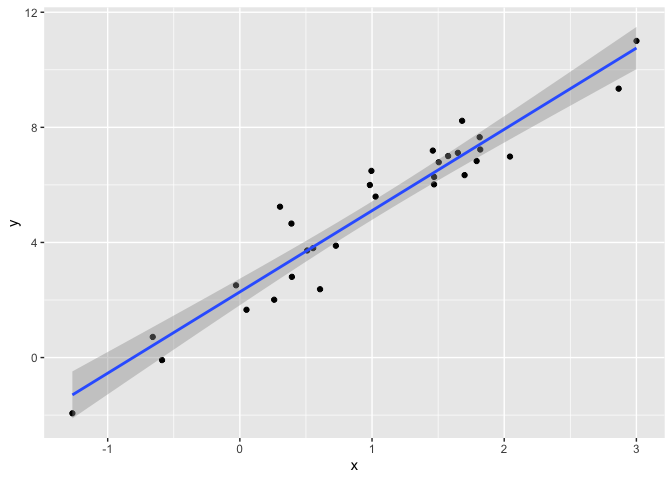
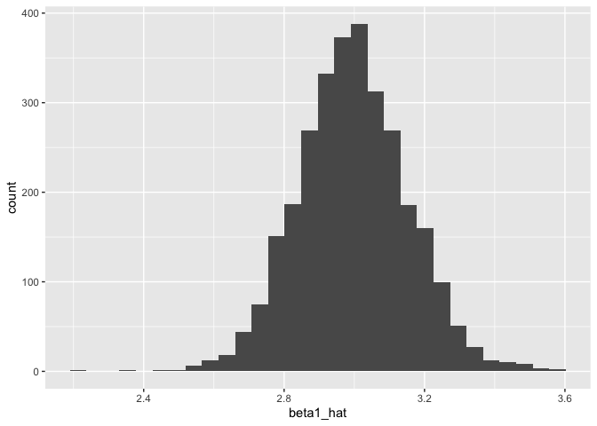
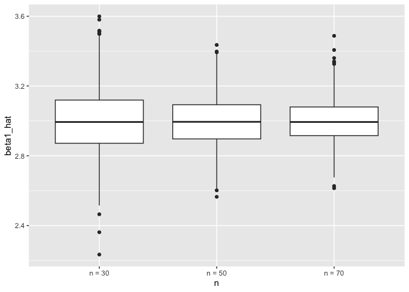
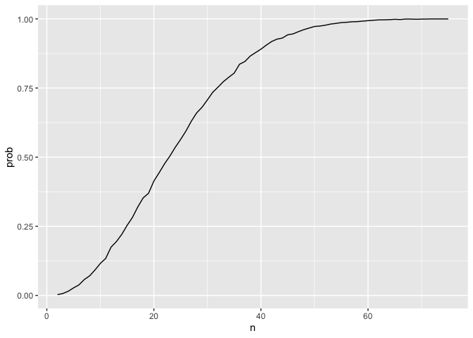

simulation
================
Chhiring Lama
2024-10-31

### Simulation: Mean and SD for one $n$

``` r
sim_mean_sd = function(n, mu = 2, sigma = 3) {
  
  sim_data = tibble(
    x = rnorm(n, mean = mu, sd = sigma),
  )
  
  sim_data |> 
    summarize(
      mu_hat = mean(x),
      sigma_hat = sd(x)
    )
}
```

Important statistical properties of estimates $\hat{\mu}$ are
established under the conceptual framework of repeated sampling. If you
could draw from a population over and over, your estimates will have a
known distribution: $\hat{\mu} \sim N(\mu, \frac{\sigma}{\sqrt{n}})$

Let’s run sim_mean_sd() 100 times to see the effect of randomness in 𝑥𝑖
on estimates $\hat{\mu}, \hat{\sigma}$

``` r
output = vector("list", 1000)

for (i in 1:1000) {
  output[[i]] = sim_mean_sd(30)
}

sim_results = bind_rows(output)

sim_results |> 
  summarize(average_mean = mean(mu_hat), 
            sd_mean = sd(mu_hat))
```

    ## # A tibble: 1 × 2
    ##   average_mean sd_mean
    ##          <dbl>   <dbl>
    ## 1         2.00   0.522

Can I use map instead?

``` r
sim_res <- tibble(
    iter = 1:1000
  ) |> 
  mutate(sample_res = map(iter, sim_mean_sd, n = 30)) |> 
  unnest(sample_res)
```

### Simulation: Mean for several *n*

Could I try different sample sizes?

``` r
sim_res <-
  expand_grid(
    n = c(10, 30, 60, 100),
    iter = 1:1000
  ) |> 
  mutate(sample_res = map(n, sim_mean_sd))|> 
  unnest(sample_res)
```

``` r
sim_res |> 
  group_by(n) |> 
  summarize(
    sd = sd(mu_hat)
  )
```

    ## # A tibble: 4 × 2
    ##       n    sd
    ##   <dbl> <dbl>
    ## 1    10 0.935
    ## 2    30 0.548
    ## 3    60 0.388
    ## 4   100 0.305

``` r
sim_res |> 
  mutate(n = str_c("n = ", n),
         n = fct_inorder(n)) |> 
  ggplot(aes(x = n, y = mu_hat, fill = n)) +
  geom_violin()
```

<!-- -->

### SLR

``` r
sim_data <-
  tibble(
    x = rnorm(n = 30, mean = 1, sd = 1), 
    y = 2+3*x + rnorm(30, 0, 1)
  )

lm_fit = lm(y ~ x, data = sim_data)

sim_data |> 
  ggplot(aes(x =x , y =y)) +
  geom_point() +
  geom_smooth(method = "lm")
```

    ## `geom_smooth()` using formula = 'y ~ x'

<!-- -->

Creating a function for the operation above

``` r
sim_reg <- function(sample_size){
  sim_data <-
  tibble(
    x = rnorm(n = sample_size, mean = 1, sd = 1), 
    y = 2+3*x + rnorm(sample_size, 0, 1)
  )
  
  lm_fit = lm(y ~ x, data = sim_data)
  
  out_df <-
    tibble(
      beta0_hat = coef(lm_fit)[1], 
      beta1_hat = coef(lm_fit)[2]
    )
  
  return(out_df)
}
```

``` r
sim_res_df <-
  expand_grid(
    n = c(30, 50, 70), 
    iter = 1:1000
  ) |> 
  mutate(estimate_df = map(n, sim_reg)) |> 
  unnest(estimate_df)
```

plot them

``` r
sim_res_df |> 
  ggplot(aes(x =beta0_hat)) +
  geom_histogram()
```

    ## `stat_bin()` using `bins = 30`. Pick better value with `binwidth`.

<!-- -->

``` r
sim_res_df |> 
  ggplot(aes(x =beta1_hat)) +
  geom_histogram()
```

    ## `stat_bin()` using `bins = 30`. Pick better value with `binwidth`.

<!-- -->

``` r
sim_res_df |> 
  mutate (n = str_c("n = ", n)) |> 
  ggplot(aes(x =n, y = beta1_hat, group = n)) +
  geom_boxplot()
```

<!-- -->

There is less variance in the sample means as the sample size increases.

``` r
sim_res_df |> 
  ggplot(aes(x =beta0_hat , y =beta1_hat)) +
  geom_point()
```

<!-- -->

What’s striking about this plot is that the estimated coefficients are
inversely correlated – a lower estimate of the intercept tends to imply
a higher estimate of the slope.

### Birthday Problem!

``` r
sim_bday <- function(sample_size) {
  
  bdays = sample(1:365, size =sample_size, replace = TRUE)
  
  duplicate <- length(unique(bdays)) < sample_size
  
  return(duplicate)
}

sim_bday(50)
```

    ## [1] TRUE

Run this multiple times

``` r
sim_results <-
  expand_grid(
    n = 2:75, 
    iter = 1:10000
  ) |> 
  mutate(estimated_df = map_lgl(n, sim_bday)) |> 
  group_by(n) |> 
  summarize(prob = mean(estimated_df))
```

``` r
sim_results |> 
ggplot(aes(x = n, y = prob)) +
  geom_line()
```

<!-- -->
